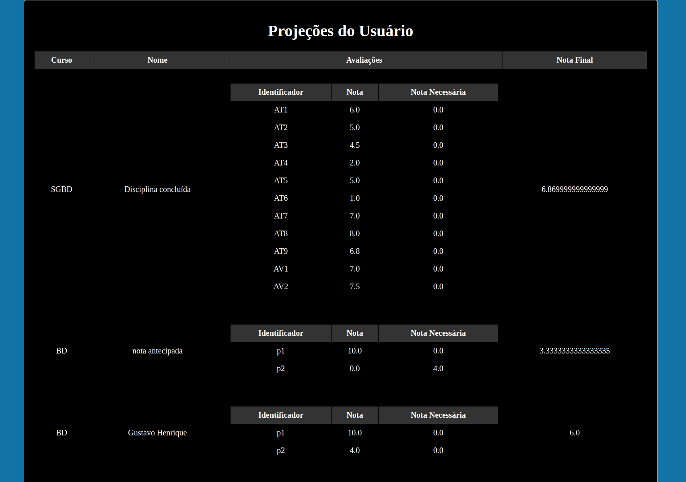

> **Read this in other languages:** [English](README_EN.md)

<h1 align="center">
  Médias API
</h1>

<p align="center">
  <a href="https://github.com/GustavoDaMassa/MediasAPI/actions/workflows/ci.yml">
    
  </a>
</p>

<p align="center">
  
</p>

# 📌 API Rest de Gestão de Notas e Projeções Acadêmicas

Esta solução foi construída originalmente com Java usando o Spring Framework neste repositório
mas também está implementada com as stacks: 
- [c#/.Net com ASPNET core](https://github.com/GustavoDaMassa/dotNetMediasAPI)
- [typeScript/nodeJS com NestJs](https://github.com/GustavoDaMassa/nodeMediasAPI)
## Apresentação

Esta API foi desenvolvida para oferecer uma solução completa na gestão de notas acadêmicas. Com ela, os usuários podem armazenar suas avaliações e obter automaticamente a média final de cada disciplina. Ela foi idealizada com o objetivo core de permitir projeções estratégicas para um melhor planejamento do desempenho acadêmico.

A característica exclusiva desta API está na personalização do método de cálculo em cada disciplina. Onde é possível definir regras próprias para o cálculo da média, tornando o sistema adaptável a diferentes abordagens. Além disso, a API calcula automaticamente a pontuação necessária para atingir a nota de corte.

Tanto estudantes quanto  docentes podem utilizá-la para gerenciar notas, criar projeções para cada aluno ou cenário e realizar o lançamento de notas.

Entenda um pouco mais sobre o escopo da **[solução](#motivação-e-solução-)** aplicada.

---

## Principais funcionalidades:

- Armazene notas de forma estruturada e eficiente.
- Defina métodos personalizados para cálculo de médias.
- Obtenha automaticamente a pontuação necessária para alcançar metas acadêmicas.
- Simule diferentes cenários para planejamento estratégico.
- Gerencie disciplinas.

---

## Demonstração



Para demonstrar o fluxo principal e exemplificar o potencial da aplicação, ela possui um simples [front-end integrado](#exemplo-1) desenvolvido com o Thymeleaf.

---
## Utilizando a API: 
 #### Antes de detalharmos os endpoints e a autenticação, é importante entender o fluxo de uso da API:

### **Login**: 
  - O usuário cria seu perfil se cadastrando no sistema.

### **Autenticação**: 
  - A API valida as credenciais e, se bem-sucedida, retorna um token JWT.
### **Disciplinas**: 
  - o usuário pode criar e editar suas disciplinas personalizadas.
### **Projeções**: 
  - Uma projeção é criada automaticamente na definição do método de cálculo no passo anterior. Usuários podem criar, editar e visualizar outras projeções.
### **Avaliações**:
  - Também criadas automaticamente a cada projeção. Usuários podem lançar notas.

 ### caso deseje compilar e navegar por si só no sistema siga para [como executar](#como-executar)

---

## Autenticação (JSON Web Token)

 Para obter um token, o usuário deve fazer uma requisição POST para o endpoint `/authenticate` com suas credenciais. O token retornado deve ser incluído no cabeçalho Authorization de todas as requisições subsequentes, exceto para cadastro.

### Gerenciamento de Roles (Perfis de Usuário)
A API implementa um sistema de roles para controle de acesso baseado em perfis. Cada usuário pode ter uma ou mais roles associadas, que determinam quais recursos e operações ele está autorizado a acessar. As roles são verificadas durante o processo de autorização, garantindo que apenas usuários com as permissões adequadas possam executar determinadas ações.


- **O usuário é autenticado através do email que é único no sistema, rota pública;**
- **Auth Type:** `Bearer Token`
- **Request Body:**
  ```json
   {
        "email":"gustavo.pereira@discente.ufg.br",
        "password":"aula321"
   }
---

## Versionamento de API

A API utiliza versionamento via URI (Uniform Resource Identifier) para gerenciar a evolução da sua interface de forma controlada e evitar quebras em clientes existentes. A versão da API é incluída diretamente no caminho da URL.

*   **Versão Atual:** `v1`
*   **Prefixo:** Todos os endpoints da API REST são prefixados com `/api/v1`.

**Exemplo:**
*   Para acessar recursos de usuário na versão 1: `/api/v1/users`
*   Para acessar recursos de cursos na versão 1: `/api/v1/{userId}/courses`

Esta estratégia garante que novas versões da API possam ser introduzidas no futuro (ex: `/api/v2/users`) sem impactar os clientes que ainda utilizam a versão anterior.

---
## API Endpoints

### user-controller


- **Cria um novo perfil de usuário, não é necessário autenticação.** 
- **Endpoint:** `POST /api/v1/users`
- **Request Body:**
   ```json
   {
      "name":"Gustavo Henrique",
      "email":"gustavo.pereira@discente.ufg.br",
      "password":"aula321"
   }
- **Response**
  ```json
   {
       "id": 2,
       "name": "Gustavo Henrique",
       "email": "gustavo.pereira@discente.ufg.br"
   }


---

- **Retorna uma lista com todos os usuários e seus respectivos id's que serão usados como parâmetros em demais requisições;**
- **Endpoint:** `GET /api/v1/users`
- **Response**
  ```json
    [
        {
            "id": 2,
            "name": "Gustavo Henrique",
            "email": "gustavo.pereira@discente.ufg.br"
        }
    ]

---

- **Parâmetro**: `id` - id do usuário;
- **Endpoint:** `PATCH /api/v1/users/{id}/name`
- **Request Body:**
   ```json
    {
        "string": "Gustavo"
    }

- **Response**
  ```json
    {
        "id": 2,
        "name": "Gustavo",
        "email": "gustavo.pereira@discente.ufg.br"
    }

---


- **Parâmetro**: `id` - id do usuário;
- **Endpoint:** `PATCH /api/v1/users/{id}/email`
- **Request Body:**
   ```json
    {
        "email":"gustavohenrique3gb@gmail.com"
    }

- **Response**
  ```json
    {
        "id": 2,
        "name": "Gustavo",
        "email": "gustavohenrique3gb@gmail.com"
    }

---


- **Parâmetro**: `id` - id do usuário;
- **Endpoint:** `DELETE /api/v1/users/{id}`
- **Response**
  ```json
    {
        "id": 2,
        "name": "Gustavo",
        "email": "gustavohenrique3gb@gmail.com"
    }

---
- **Parâmetro**: `email` - email do usuário;
- **Endpoint:** `GET /api/v1/users/{email}`
- **Response**
  ```json
    {
        "id": 2,
        "name": "Gustavo",
        "email": "gustavo.pereira@discente.ufg.br"
    }

### course-controller

---


- **Cria um novo curso, e através do método de cálculo das médias cria automaticamente uma projeção com o mesmo nome, identificando e instânciando as avaliações definidas.**
- **Parâmetro**: `userId` - id do usuário;
- **Endpoint:** `POST /api/v1/{userId}/courses`
- **Request Body:**
   ```json
    {
        "name":"SGBD",
        "averageMethod":"(0.4*(@M[6](AT1;AT2;AT3;AT4;AT5;AT6;AT7;AT8;AT9)/6))+(0,6*(AV1+AV2[10]/2))",
        "cutOffGrade": 6.0
    }

- **`AverageMethod:`**
  - Constantes são representadas por valores `double`;
  - Identificadores podem conter números, o caracter especial `_` e pelo menos uma letra;
 
  - Identificadores podem ter o sufixo `[N]` indicando a nota máxima da avaliação;
    - **N** é um `double`; 
    - caso não seja informado assume o valor default `10`.
  - `@M[n](i1;i2;...;im)` é uma funcionalidade extra além das operações aritméticas;
    - Ela faz o somatório das n maiores notas fornecidas dentre os parênteses;
    - `m>=n` ;
    - n é um `int`.
  - `cutOffGrade` também é opcional;
    - valor default `6.0`.
  - É feito a analise sintática e semântica da fòrmula.

- **Response**
  ```json
    {
        "id": 2,
        "name": "SGBD",
        "averageMethod": "(0.4*(@M[6](AT1;AT2;AT3;AT4;AT5;AT6;AT7;AT8;AT9)/6))+(0,6*(AV1+AV2[10]/2))",
        "cutOffGrade": 6
}

---


- **Lista todos os cursos do usuário.**
- **Parâmetro**: `userId` - id do usuário;
- **Endpoint:** `GET /api/v1/{userId}/courses`
- **Response**
  ```json
    [
       {
          "id": 1,
          "name": "BD 1",
          "averageMethod": "(P2+P3*2)/3",
          "cutOffGrade": 6
       },
       {
          "id": 2,
          "name": "SGBD",
          "averageMethod": "(0.4*(@M[6](AT1;AT2;AT3;AT4;AT5;AT6;AT7;AT8;AT9)/6))+(0,6*(AV1+AV2[10]/2))",
          "cutOffGrade": 6
       }
    ]


---


- **Endpoint:** `PATCH /api/v1/{userId}/courses/{id}/name`
- **Parâmetros**: 
  - `userId` - id do usuário;
    - `id` - id da disciplina.
- **Request Body**
    ```json
  {
      "string":"BD"
  }
- **Response**
    ```json
    {
        "id": 1,
        "name": "BD",
        "averageMethod": "(P2+P3*2)/3",
        "cutOffGrade": 6.0
    }


---


- **Altera a forma como o método de cálculo da média final é definida. Deleta as projeções equivalentes e criar uma nova atualizada com um novo id pra essa projeção.**
- **Endpoint:** `PATCH /api/v1/{userId}/courses/{id}/method`
- **Parâmetros**:
    - `userId` - id do usuário;
    - `id` - id da disciplina.
- **Request Body**
    ```json
  {
      "string":"(P2+P3)/2"
  }
- **Response**
    ```json
    {
        "id": 1,
        "name": "BD",
        "averageMethod": "(P2+P3)/2",
        "cutOffGrade": 6.0
    }

---


- **Endpoint:** `PATCH /api/v1/{userId}/courses/{id}/cutoffgrade`
- **Parâmetros**:
    - `userId` - id do usuário;
    - `id` - id da disciplina.
- **Request Body**
    ```json
  {
      "value": 7
  }
- **Response**
    ```json
    {
        "id": 1,
        "name": "BD",
        "averageMethod": "(P2+P3)/2",
        "cutOffGrade": 7.0
    }

---


- **Parâmetro**: `userId` - id do usuário;
- **Endpoint:** `GET /api/v1/{userId}/courses/projections`
- **Lista todos os cursos juntamente com suas projeções e as atividades.**
- **Response**
  ```json
  [
     {
          "id": 2,
          "name": "SGBD",
          "assessment":[
              {
                 "id": 3,
                 "identifier": "AT1",
                 "grade": 0,
                 "requiredGrade": 4.7
              },
              {
                 "id": 4,
                 "identifier": "AT2",
                 "grade": 0,
                 "requiredGrade": 4.7
              },
                    .
                    .
                    .
                    .
                    .
              {
                 "id": 12,
                 "identifier": "AV1",
                 "grade": 0,
                 "requiredGrade": 4.7
              },
              {
                 "id": 13,
                 "identifier": "AV2",
                 "grade": 0,
                 "requiredGrade": 4.7
              }
          ],
          "finalGrade": 0,
          "courseName": "SGBD"
     },
     {
          "id": 4,
          "name": "BD",
          "assessment": [
              {
                 "id": 16,
                 "identifier": "P2",
                 "grade": 0,
                 "requiredGrade": 7
              },
              {
                 "id": 17,
                 "identifier": "P3",
                 "grade": 0,
                 "requiredGrade": 7
              }
          ],
          "finalGrade": 0,
          "courseName": "BD"
     }
  ]


---


- **Deletar curso**
- **Endpoint:** `DELETE /api/v1/{userId}/courses/{id}`
- **Parâmetro**: `userId` - id do usuário;
- **Response**
    ```json
    {
        "id": 1,
        "name": "BD",
        "averageMethod": "(P2+P3)/2",
        "cutOffGrade": 7.0
    }

### projection-controller

---


-**Cria uma nova projeção e automaticamente suas avaliações de acordo com a definição do curso.**
- **Endpoint:** `POST /api/v1/{courseId}/projections`
- **Parâmetro**: `courseId` - id da disciplina;
- **Request Body**
    ```json
      {
          "string": "projeção 2"
      }
- **Response**
    ```json
    {
        "id": 5,
        "name": "projeção 2",
            .
            .
            .
        "finalGrade": 0.0,
        "courseName": "SGBD"
    }
---


- **retorna todas as projeções de um determinido curso com uma lista de avaliações equivalentes.**
- **Endpoint:** `GET /api/v1/{courseId}/projections`
- **Parâmetro**: `courseId` - id da disciplina;
  - **Response**
      ```json
    [
        {
          "id": 2,
          "name": "SGBD",
          "assessment": [
              {
                  "id": 3,
                  "identifier": "AT1",
                  "grade": 0.0,
                  "requiredGrade": 4.7
              },
              {
                  .
                  .
                  .
                  .
              {
                  "id": 10,
                  "identifier": "AT8",
                  "grade": 0.0,
                  "requiredGrade": 4.7
              },
              {
                  "id": 11,
                  "identifier": "AT9",
                  "grade": 0.0,
                  "requiredGrade": 4.7
              },
              {
                  "id": 12,
                  "identifier": "AV1",
                  "grade": 0.0,
                  "requiredGrade": 4.7
              },
              {
                  "id": 13,
                  "identifier": "AV2",
                  "grade": 0.0,
                  "requiredGrade": 4.7
              }
          ],
          "finalGrade": 0.0,
          "courseName": "SGBD"
        },
        {
          "id": 5,
          "name": "projeção 2",
          "assessment": [
              {
                  "id": 18,
                  "identifier": "AT1",
                  "grade": 0.0,
                  "requiredGrade": 4.7
              },
                  .
                  .
                  .
                  .
              {
                  "id": 28,
                  "identifier": "AV2",
                  "grade": 0.0,
                  "requiredGrade": 4.7
              }
          ],
          "finalGrade": 0.0,
          "courseName": "SGBD"
        }
    ]
---


- **Endpoint:** `PATCH /api/v1/{courseId}/projections/{id}`
- **Parâmetro**: `courseId` - id da disciplina;
- **Parâmetro**: `id` - id da projeção;
- **Request Body**
    ```json
      {
          "string":"Projeção otimista"
      }
- **Response**
    ```json
    {
       "id": 5,
      "name": "Projeção otimista",
         .
         .
         .
      "courseName": "SGBD"
    }
---


- **Deleta apenas a projeção especificada.**
- **Endpoint:** `DELETE /api/v1/{courseId}/projections/{id}`
- **Parâmetro**: `courseId` - id da disciplina;
- **Parâmetro**: `id` - id da projeção;
- **Response**
    ```json
    {
      "id": 5,
      "name": "Projeção otimista",
         .
         .
         .
      "courseName": "SGBD"
    }

---


- **Deleta todas as projeções do curso, incluindo a projeção default.**
- **Endpoint:** `DELETE /api/v1/{courseId}/projections/all`
- **Parâmetro**: `courseId` - id da disciplina;

---


- **Lista todas as avaliações de uma projeção.**
- **Endpoint:** `GET /api/v1/{projectionId}/assessments`
- **Parâmetro**: `projectionId` - id da projeção;
- **Response**
    ```json
  [
       {
          "id": 3,
          "identifier": "AT1",
          "grade": 0.0,
          "requiredGrade": 4.7
       },
       {
          "id": 4,
          "identifier": "AT2",
          "grade": 0.0,
          "requiredGrade": 4.7
       },
       {
          .
          .
          .
          .
       {
          "id": 13,
          "identifier": "AV2",
          "grade": 0.0,
          "requiredGrade": 4.7
        }
  ]


---


- **Posta a nota adquirida. Automaticamente a média final é calculada juntamente com o quanto de pontuação ainda falta em cada avaliação ainda não realizada, para atingir a nota de corte.**
- **Endpoint:** `PATCH /api/v1/{projectionId}/assessments/{id}`
- **Parâmetro**: `projectionId` - id da projeção;
- **Parâmetro**: `id` - id da avaliação;
- **Request Body**
    ```json
  {
      "value": 7
  }
  
- **Response**
    ```json
    {
       "id": 12,
       "identifier": "AV1",
       "grade": 7.0,
       "requiredGrade": 0.0
  }

---

### 📌 Observando os resultados
Após esse fluxo podemos realizar uma requisição para o end-point `/api/v1/{courseId}/projections` com o método HTTP `GET` e observa:

- **o cálculo automático para a média final;**
- **O cálculo para as notas requeridas.**
  - aquelas em que a nota está definida recebe o valor zero;
  - São calculadas de forma uniforme.

- **Response**
    ```json
      [
    {
        "id": 2,
        "name": "SGBD",
        "assessment": [
            {
                "id": 3,
                "identifier": "AT1",
                "grade": 6.0,
                "requiredGrade": 0.0
            },
            {
                "id": 4,
                "identifier": "AT2",
                "grade": 5.0,
                "requiredGrade": 0.0
            },
            {
                "id": 5,
                "identifier": "AT3",
                "grade": 0.0,
                "requiredGrade": 1.9
            },
            {
                "id": 6,
                "identifier": "AT4",
                "grade": 0.0,
                "requiredGrade": 1.9
            },
            {
                "id": 7,
                "identifier": "AT5",
                "grade": 0.0,
                "requiredGrade": 1.9
            },
            {
                "id": 8,
                "identifier": "AT6",
                "grade": 0.0,
                "requiredGrade": 1.9
            },
            {
                "id": 9,
                "identifier": "AT7",
                "grade": 0.0,
                "requiredGrade": 1.9
            },
            {
                "id": 10,
                "identifier": "AT8",
                "grade": 0.0,
                "requiredGrade": 1.9
            },
            {
                "id": 11,
                "identifier": "AT9",
                "grade": 0.0,
                "requiredGrade": 1.9
            },
            {
                "id": 12,
                "identifier": "AV1",
                "grade": 7.0,
                "requiredGrade": 0.0
            },
            {
                "id": 13,
                "identifier": "AV2",
                "grade": 0.0,
                "requiredGrade": 1.9
            }
        ],
        "finalGrade": 4.933333333333334,
        "courseName": "SGBD"
    }
  ]

- Cálculo : 0.4*((**6**+**5**+0+0+0+0)/6)+0,6*(**7**+(0/2))

--- 
## Modelo de Dados


- Usuário possui N --> Disciplinas;
- Disciplina possui N --> Projeções;
- Projeção possui N --> Avaliações;

Todos os id são chaves primárias. Entidades possuem uma constraint de unicidade entre seus respectivos `name` e `id`, no caso de Assessment essa unicidade é entre o `identifier` e seu `id`.

---

##  Tratamento de Exceções

A API retorna respostas padronizadas para erros e exceções. Abaixo estão os códigos de erro e suas descrições:

###  Exceções customizadas

| StatusCode | Exceção            | Error example                                             |
|------------|--------------------|-----------------------------------------------------------|
| 404        | `NotFoundArgumentException`  | Course id 30 not found for UserId 2                       |
| 400        | `IllegalArgumentException` | It is not possible to select more values than those provided |
| 400        | `NoSuchElementException`    | The equation has operators without arguments              |
| 400        | `DataIntegrityException`     | The attribute SGBD already exist for this context         |
| 500        | `InternalServerError` | possible division by zero detected                                     |

### Exemplo:
- **Método**: POST;
- **URI** {userId}/courses
  - **Request:**
  ```json
  {
      "name":"Grego",
      "averageMethod":" 2,5(P_1)+3 / 2,5*(P2#)3 ",
      "cutOffGrade": 6.0
  }
- **Response:**
  ```json
  {
    "statusCode": 400,
    "error": "Method for calculating averages not accepted, formula terms are invalid: 2,5----------#-3",
    "path": "/2/courses",
    "timestamp": "2025-03-28T17:31:04.744315954"
  }
---
## Como executar

A Aplicação utiliza o Docker e é disponibilizada dentro de um container com a imagem da api e do banco de dados ao qual se conecta.

#### Dependências:

- [Docker](#docker);
- [Docker Compose](#docker-compose).

### Opção 1


#### Passos para rodar:
  
  - Clone o repositório e entre no diretório:
```
git clone https://github.com/GustavoDaMassa/MediasAPI.git
cd MediasAPI
```
- Suba o container com um imagem atualizada:
```
docker compose up --build -d 
```
- parando a aplicação:
```
docker compose down
```
### Opção 2
 **caso deseje rodar com mais facilidade sem a necessidade de clonar o repositório**

- Baixe o arquivo  [docker compose](./Compose%20docker%20/docker-compose.yaml)
  - esse arquivo cria uma instância da aplicação de acordo com a versão mais recente presente no repositório [docker hub](https://hub.docker.com/r/gustavodamassa/medias-api/tags);
  - **mantenha o nome do arquivo.**
- execute o seguinte comando no repositório em que o arquivo foi baixado
```
docker compose up
```
### Aplicação no ar 

  após executada você pode navegar por ela realizando requisições através do:
 ### - [Swagger do projeto](https://localhost/swagger-ui/index.html)
  - ou por algum API Client de preferência em **https://localhost**

---

## Configuração HTTPS com Nginx (Docker)

Para garantir a segurança da comunicação, a API é exposta via HTTPS em ambiente Docker, utilizando o Nginx como um reverse proxy.

### Como funciona:
1.  **Nginx como Reverse Proxy:** O Nginx intercepta todas as requisições externas na porta 443 (HTTPS).
2.  **Terminação SSL:** O Nginx é responsável por descriptografar o tráfego HTTPS e encaminhá-lo para a aplicação Spring Boot (que roda internamente em HTTP na porta 8080) dentro da rede Docker.
3.  **Redirecionamento HTTP para HTTPS:** Qualquer tentativa de acesso via HTTP (porta 80) é automaticamente redirecionada para HTTPS.

### Certificados SSL:
*   **Desenvolvimento Local:** Para facilitar o desenvolvimento, um certificado SSL autoassinado é gerado e utilizado pelo Nginx. Ao acessar `https://localhost`, seu navegador exibirá um aviso de segurança, que pode ser ignorado com segurança para fins de desenvolvimento.
*   **Produção:** Em um ambiente de produção, é **essencial** substituir o certificado autoassinado por um certificado emitido por uma Autoridade Certificadora (CA) confiável, como o Let's Encrypt. Isso garante que os usuários não recebam avisos de segurança e que a comunicação seja totalmente segura e verificada.

---

### Dependências

####  Docker:
Instalar conforme o sistema operacional:

- Linux (Ubuntu/Debian):

``` 
  sudo apt update && sudo apt install docker.io -y
```
```
  sudo systemctl enable --now docker
```

- Windows/Mac: Baixar e instalar o [Docker Desktop](https://www.docker.com/products/docker-desktop/).

####  Docker Compose:

- Linux
```
  sudo apt install docker-compose -y
```
- Windowns/mac: o Docker Compose já vem no Docker Desktop.

---

## Configuração CORS

Para garantir a segurança e a interoperabilidade com aplicações frontend, esta API implementa uma política de Cross-Origin Resource Sharing (CORS) global.

### Como funciona:
1.  **Controle de Origens:** A API define explicitamente quais domínios (origens) têm permissão para fazer requisições HTTP/HTTPS para seus endpoints. Isso impede que sites não autorizados acessem seus recursos.
2.  **Métodos e Cabeçalhos Permitidos:** São especificados os métodos HTTP (GET, POST, PUT, DELETE, OPTIONS) e cabeçalhos que podem ser utilizados nas requisições cross-origin.
3.  **Credenciais:** A configuração permite o envio de credenciais (como tokens de autenticação JWT ou cookies) em fluxos de autenticação.

---

## Exemplo

---
## Motivação e Solução 

Durante a jornada acadêmica na universidade, gerenciar as notas ou até mesmo apenas armazená-las é um processo que pode ser automatizado de maneira eficiente. No entanto, como cada professor e disciplina definem seus próprios métodos de avaliação e critérios de desempenho de acordo com suas preferências e abordagens, há uma grande variabilidade e flexibilidade nesse processo.

Para que a aplicação possa suportar essas definições personalizadas, foi implementada uma solução baseada no processamento de expressões regulares, permitindo a identificação e manipulação dinâmica de variáveis, constantes e operadores. Dessa forma, o cálculo das médias finais é automatizado de maneira flexível e adaptável a diferentes regras de avaliação.

Outro desafio foi a implementação desse cálculo dinâmico. A solução adotada utiliza a notação polonesa inversa (RPN), que elimina a necessidade de parênteses ao definir a ordem correta de precedência diretamente em sua estrutura. Além disso, foi empregada uma adaptação do algoritmo Shunting Yard, utilizando pilhas e listas como estruturas de dados para garantir a correta avaliação das expressões.

```
^(\d+(([.,])?\d+)?)(?=[\+\-\*\/])|(?<=[\+\-\*\/\(;])(\d+(([.,])?\d+)?)(?=[\+\-\*\/\);])|(?<=[\+\-\*\/])(\d+(([.,])?\d+)?)$|[\+\-\*\/\(\)\;]|(?<=[\+\-\*\/\)\(;])@M(\[\d+\]\()?|^@M(\[\d+\]\()?|(?<!@)\w*[A-Za-z]\w*(\[(\d+(([.,])?\d+)?)\])?
```
- ferramenta para engenharia de Regex:  [regexr](https://regexr.com/)

---

## Práticas Adotadas

- **Arquitetura e Design**
  - API REST com divisão em camadas
  - Aplicação dos princípios SOLID
  - Injeção de Dependências
  - Uso do padrão Data Transfer Object (DTO)

- **Validação e Segurança**
  - Validações personalizadas e uso do Bean Validation
  - Implementação de autenticação e autorização via JWT
  - Configuração de CORS para controle de acesso de origens

- **Tratamento de Erros e Respostas**
  - Captura e tratamento de erros padronizados

- **Documentação**
  - Documentação da API com diagramas e exemplos
  - Documentação técnica dos endpoints com OpenAPI 3

- **Testes e Qualidade de Código**
  - Testes automatizados com criação de mocks e ambiente separado

- **Banco de Dados**
  - Modelagem do banco de dados relacional com definições de constraints
  - Consultas JPQL e SQL nativo com Spring Data JPA

- **Ferramentas e Deploy**
  - Uso de API Client e Database Client durante o desenvolvimento
  - Encapsulamento da aplicação com Docker, criando imagens e containers personalizados
  - Versionamento de código com Git

- **CI/CD com GitHub Actions**
  - O projeto utiliza um pipeline de Integração Contínua (CI) com GitHub Actions.
  - A cada `push` ou `pull request` para o branch `main`, o workflow em `.github/workflows/ci.yml` é acionado.
  - O pipeline realiza o checkout do código, configura o ambiente Java 17 e executa o comando `./mvnw test` para compilar e testar a aplicação, garantindo que novas alterações não quebrem o código existente.
  
### Tecnologias

- [Spring Boot](https://spring.io/projects/spring-boot)
- [SpringDoc OpenAPI 3](https://springdoc.org/v2/#spring-webflux-support)
- [Maven](https://maven.apache.org/)
- [H2 DataBase](https://www.h2database.com/html/main.html)
- [Bean Validation](https://beanvalidation.org/)
- [Spring Security](https://docs.spring.io/spring-security/reference/index.html)
- [JUnit](https://junit.org/junit5/)
- [Mysql](https://dev.mysql.com/downloads/)
- [Workbench](https://www.mysql.com/products/workbench/)
- [Postman](https://postman.com/)
- [Docker](https://www.docker.com/products/docker-hub/)
---

## Observabilidade e Logging

Para garantir a visibilidade do comportamento da aplicação e facilitar o diagnóstico de problemas, implementamos um sistema de logging estruturado e um ambiente de observabilidade local com o ELK Stack.

### Logging Estruturado

A aplicação agora gera logs em formato JSON, o que os torna facilmente legíveis por máquinas e ideais para processamento por ferramentas de análise de logs.

*   **Formato JSON**: Todos os logs são emitidos em formato JSON, utilizando a biblioteca `logstash-logback-encoder`. Isso permite uma fácil ingestão e análise por sistemas como o Elasticsearch.
*   **Contexto Enriquecido (MDC)**: Para requisições autenticadas, o e-mail do usuário (`userEmail`) é automaticamente adicionado ao contexto de cada log (Mapped Diagnostic Context - MDC). Isso facilita o rastreamento de ações de usuários específicos.
*   **Logs de Erro Detalhados**: O `GlobalExceptionHandler` foi instrumentado para registrar todas as exceções capturadas no nível `ERROR`, incluindo o stack trace completo, garantindo que nenhum erro passe despercebido.
*   **Logs de Requisição**: Os principais endpoints dos controllers REST agora registram mensagens de `INFO` ao serem acessados, fornecendo visibilidade sobre o fluxo das requisições.

### Observabilidade Local com ELK Stack (Elasticsearch, Logstash, Kibana)

Um ambiente ELK Stack foi configurado via `docker-compose` para coletar, processar e visualizar os logs JSON da aplicação localmente.

#### Componentes:
*   **Elasticsearch**: Armazena e indexa os logs JSON.
*   **Logstash**: Recebe os logs da aplicação via TCP, processa-os e os envia para o Elasticsearch.
*   **Kibana**: Interface web para buscar, analisar e visualizar os logs armazenados no Elasticsearch.

#### Como Utilizar:

**1. Iniciar o ELK Stack:**

Para iniciar apenas os serviços do ELK Stack (útil para quando você executa a aplicação pela IDE):

```bash
docker-compose up -d elasticsearch logstash kibana
```

Para iniciar o ambiente completo (aplicação, banco de dados, Nginx e ELK):

```bash
docker-compose up -d
```

**2. Acessar o Kibana:**

Após os contêineres subirem (pode levar alguns minutos para o Elasticsearch e Kibana estarem totalmente prontos), acesse o Kibana no seu navegador:

```
http://localhost:5601
```

**3. Configurar o Padrão de Índice no Kibana:**

Na primeira vez que acessar o Kibana, ou se ainda não o fez:
*   Vá para **Management** (ícone de engrenagem) -> **Stack Management** -> **Index Patterns**.
*   Clique em **Create index pattern**.
*   No campo "Index pattern name", digite `mediasapi-logs-*` e clique em **Next step**.
*   No campo "Time field", selecione `@timestamp` e clique em **Create index pattern**.

**4. Visualizar os Logs:**

Vá para **Analytics** (ícone de bússola) -> **Discover**. Você deverá ver os logs JSON da sua aplicação.

#### Executando a Aplicação:

*   **Via Docker (com `docker-compose up -d`)**: A aplicação (`mediasapi`) será iniciada com o perfil `docker` ativo, e os logs serão enviados automaticamente para o serviço `logstash` dentro da rede Docker.
*   **Via IDE (IntelliJ, etc.)**: Inicie a classe `MediasApiApplication` diretamente. A aplicação usará o perfil padrão, que envia os logs para `localhost:5000`. Certifique-se de que o ELK Stack esteja rodando (passo 1) para que o Logstash receba os logs.

---

## Monitoramento e Saúde da Aplicação (Health Check)

Este projeto utiliza o **Spring Boot Actuator** para expor endpoints que permitem o monitoramento da saúde e do estado da aplicação. Isso é fundamental para garantir a resiliência e a observabilidade em um ambiente de produção.

### Endpoints Disponíveis

*   **Health Check Geral:** `GET /actuator/health`
    *   Retorna um status detalhado da aplicação, incluindo a conectividade com o banco de dados e o espaço em disco.

*   **Liveness Probe:** `GET /actuator/health/liveness`
    *   Indica se a aplicação está em execução (viva). Usado por orquestradores de contêineres (como Docker e Kubernetes) para decidir se um contêiner precisa ser reiniciado.

*   **Readiness Probe:** `GET /actuator/health/readiness`
    *   Indica se a aplicação está pronta para aceitar novas requisições. Usado por balanceadores de carga para decidir se devem ou não enviar tráfego para uma instância da aplicação.